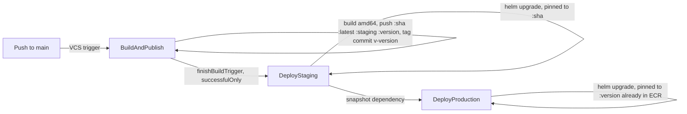

# Deployment Workflow

Pipeline defined in [.teamcity/](../.teamcity/): `BuildAndPublish`, `DeployStaging`, `DeployProduction`.

## Staging

Trigger: any push to `main`.

- `BuildAndPublish` ([.teamcity/BuildAndPublish.kt](../.teamcity/BuildAndPublish.kt)) builds the amd64 image and pushes to ECR as `:<sha>`, `:latest`, `:staging`, and `:<version>` — where `<version>` is `<major>.<minor>.<build counter>`. The major/minor prefix is read from `package.json` and the build number is overridden via `##teamcity[buildNumber ...]` in the first build step (package.json isn't readable from the DSL script itself — TeamCity sandboxes settings generation to `.teamcity/`), and the counter auto-increments per build. A VCS Labeling feature tags the commit `v<version>` in git once the build succeeds — no one has to invent or push a version by hand.
- `DeployStaging` ([.teamcity/DeployStaging.kt](../.teamcity/DeployStaging.kt)) is chained via a `finishBuildTrigger` (`successfulOnly = true`) off `BuildAndPublish`, and deploys the **exact `:<sha>`** built — not the floating `:staging` tag. A floating tag produces a byte-identical rendered manifest across runs, so `helm upgrade` sees no pod-template diff and skips the rollout; pinning to the sha avoids that. It re-exposes both the sha and the version (`outputs.imageTag`, `outputs.version`) for `DeployProduction` to consume.

## Production

Trigger: **manual** — run `DeployProduction` from the TeamCity UI (or its REST "Run Build" endpoint). There is no VCS or tag trigger.

- `DeployProduction` ([.teamcity/DeployProduction.kt](../.teamcity/DeployProduction.kt)) has a mandatory snapshot dependency on `DeployStaging`, resolving to the last successful `DeployStaging` build on main and its `outputs.version` parameter.
- No rebuild, no retagging. The image at `:<version>` already exists in ECR — `BuildAndPublish` pushed it — so this build just runs `deploy.sh production <version>` (`helm upgrade --install`) into the prod namespace.
- The click to run the build **is** the promotion action and the approval gate; there's no separate PR-based promotion step.

## Notes

- The VCS root's branch specification previously needed `+:refs/tags/(v*)` for the old tag-based production trigger. That's no longer required — the git tags produced by VCS Labeling are for traceability (`git tag` shows every version that was built), not for triggering anything.
